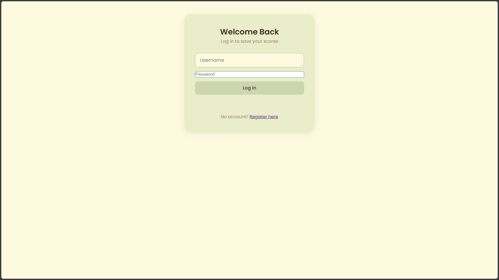
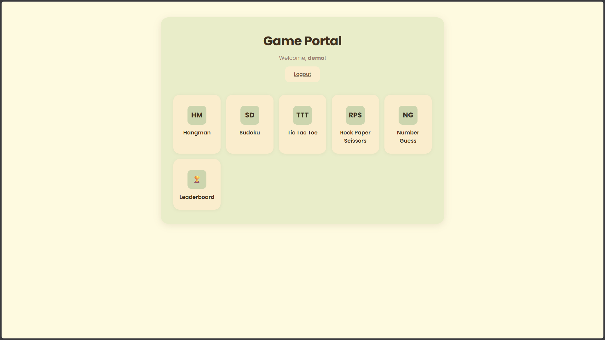
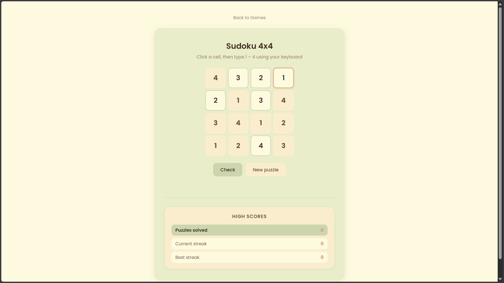
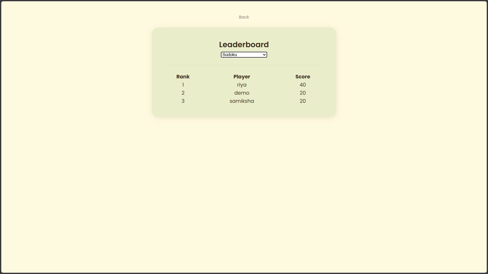

#  Multi Game Portal

A web-based gaming platform developed using **PHP, MySQL, HTML, CSS, and JavaScript**. The portal allows users to register, log in, play multiple classic browser games, track their scores, and compete on a leaderboard through a simple and interactive interface.

---

##  Features

- Secure User Registration & Login
- Multiple Classic Browser Games
- Score Tracking System
- Global Leaderboard
- Responsive & User-Friendly Interface
- Database Integration using MySQL

---

##  Games Available

- Tic Tac Toe
- Sudoku
- Hangman
- Rock Paper Scissors
- Number Guess

---

##  Tech Stack

| Technology | Purpose                    |
| ---------- | -------------------------- |
| PHP        | Backend Development        |
| MySQL      | Database                   |
| HTML5      | Structure                  |
| CSS3       | Styling                    |
| JavaScript | Game Logic & Interactivity |

---

##  Project Structure

```text
gameportal/
├── css/
├── js/
├── pages/
├── php/
├── index.php
└── README.md
```

---

##  Getting Started

### Prerequisites

- XAMPP/WAMP/LAMP
- PHP 8+
- MySQL

### Installation

1. Clone the repository.
2. Move the project folder into your web server's `htdocs` directory.
3. Create a MySQL database named `gameportal`.
4. Import the provided SQL database.
5. Update the database credentials in `php/db.php` if needed.
6. Start Apache and MySQL.
7. Open:

```text
http://localhost/gameportal/
```

---

##  Screenshots

### Landing Page



### Dashboard



### Game Interface



### Leaderboard



---

## S License

This project was developed for educational and learning purposes.
